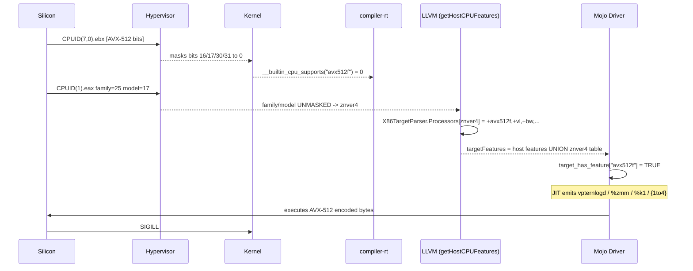

# Day One Hundred Eighty-Seven: Phantom Bugs in the CI Machines

```text
model name        : AMD EPYC 9V74 80-Core Processor
vendor_id         : AuthenticAMD
Hypervisor vendor : Microsoft
Virtualization type : full
```

That capture, pulled from `/proc/cpuinfo` inside a GitHub Actions container at
06:31 on May 12, broke the investigation open.

For Months now, I have been hitting my head against a wall trying
to make CI/CD green. Multiple bugs filed and fixed, yet getting nowhere. This final
issue has been a marathon sprint over the past 6 days trying to track down a
crash that ONLY occurs on github runners.  Every hypothesis I had filed against
[modular/modular#6413](https://github.com/modular/modular/issues/6413)
assumed an Intel CPU. Every cross-machine reproduction attempt was on Intel
hardware. Every model in my head was Intel. Intel Inside has been the marketing
mantra for so long, I didn't even question that assumption that the CPU manufacturer
could have been the clue.

To understand why that four-line block from `/proc/cpuinfo` was the moment
everything pivoted — and why it took a month to capture it — you have to go
back to April.

---

**Project:** ML Odyssey
**Date:** May 12, 2026
**Branch:** `bisect/6413-positive-control`
**Tags:** #mojo #debugging #ci #jit #cross-cpu-survey #modular-bug

---

## Chapter 1: Where We Left Off

[Day 165](../04-20-2026/) closed out the first of the two crash signatures
that had been blocking ProjectOdyssey CI for a month: virtual address space
exhaustion in the Mojo JIT, filed as
[modular/modular#6433](https://github.com/modular/modular/issues/6433),
documented with a `ulimit -v` binary search and a one-command reproducer.
That fix landed. Sixteen blocked PRs unstuck. CI looked like it would finally
go green.

The second crash signature — internally labelled *"the libKGEN flake"* —
did not go away. It kept firing, intermittently, on the `Data Utilities
Test Suite` and `Configs` jobs at something like a one-in-six rate. The
stack trace was always the same noise: `__fortify_fail_abort` inside
`libKGENCompilerRTShared.so`, no source location, no symbol, no register
context the harness would let us see. The crash file contained 28 bytes of
log output. None of it was useful.

My current understanding is that the reason it contained 28 bytes of log
output was that libKGEN installs its own signal handler at startup. When
the runtime hits a fatal fault, the kernel delivers a signal to the
process, libKGEN's handler intercepts it before anything else can,
prints its 28 bytes, and calls `_exit(134)`. The kernel never gets a
chance to generate a core dump. **We had been debugging a crash whose
stack trace was the handler, not the bug.** Whatever the underlying
fault actually was, the handler repainted it into the same 28-byte
non-answer every time.

At the close of Day 165 we had a workaround note about this in
[`docs/dev/mojo-jit-crash-workaround.md`](../../../docs/dev/mojo-jit-crash-workaround.md)
— it speculated about JIT volume thresholds and recommended retries.
That document is now historical. Everything in it about the cause is
wrong. Only the *symptom* matches: an unexplained, non-deterministic
fatal fault in a process whose handler swallows it before the kernel
can record what happened.

The plan, going into April, was modest and — in retrospect — wrong: get
CI/CD green by reducing the JIT's load until the flake stopped firing.
The next month was spent acting on that plan. None of it worked. The
shape of the bug was not what I thought.

---

## Chapter 2: A Month of Chasing a 100% Reproducer

Look at the dates on
[modular/modular#6413](https://github.com/modular/modular/issues/6413) and
[modular/modular#6433](https://github.com/modular/modular/issues/6433).
6413 was filed on **April 12**. 6433 was filed mid-month and closed out
on April 20. The first comment I posted on 6413 with *real core dumps* was
**May 11**.

Between April 12 and May 8, I had nothing to go on but the crashpad: a
non-zero exit out of `mojo` inside the container, intermittently, on a
subset of test jobs, the single string `__fortify_fail_abort` inside
`libKGENCompilerRTShared.so`, and no other context. No backtrace I could
trust. No register state. No deterministic input. That is what I had to
work with for four weeks.

Through all of April, I treated this as a **flaky JIT** — the same family
of failure as `mojo-jit-crash-workaround.md` had been describing since
March, and I had been dealing with for months prior. The entire shape of
the investigation was *"this is some kind of heap or scheduling flake in
the JIT, and the way to defeat a flake is to find a 100% reproducible test
case that triggers it on demand."*

So that is what I tried to do.

### The flaky-JIT mitigation lineage

Months before the rest of this story starts, the same crash family had
already provoked an escalating series of mitigations. None of them treated the
crash as a code-generation bug; all of them treated it as a transient
fault in a JIT pipeline that needed retries, smaller compilation units, or
quieter test environments. In rough chronological order:

- [PR #3958 (Mar 7)](https://github.com/HomericIntelligence/ProjectOdyssey/pull/3958) —
  *"document Mojo JIT crash workaround for libKGENCompilerRTShared.so"*
- [PR #4744 (Mar 14)](https://github.com/HomericIntelligence/ProjectOdyssey/pull/4744) —
  *"add retry logic for flaky JIT test groups"*
- [PR #5161 (Mar 26)](https://github.com/HomericIntelligence/ProjectOdyssey/pull/5161) —
  *"mitigate Data test JIT crashes with targeted submodule imports"*
- [PR #5167 (Mar 26)](https://github.com/HomericIntelligence/ProjectOdyssey/pull/5167) —
  *"eliminate per-element bitcast in gradient checker tight loops"*
- [PR #5171 (Mar 26)](https://github.com/HomericIntelligence/ProjectOdyssey/pull/5171) —
  *"add per-file JIT crash retry for Mojo 0.26.1"*

That is the history for this blog, the pre-history goes back further.
Each of these PRs assumes the same model of the bug — *the JIT is fragile
under certain loads, and the fix is to relieve the load or retry through
the failure* — and each of them is informed by no more than what the
crashpad chose to print.

### April 12 — the upstream issue is filed

I opened
[modular/modular#6413](https://github.com/modular/modular/issues/6413) on
April 12 with the bug-report I could write at the time: *execution
crashed in libKGENCompilerRTShared.so inside Docker containers, but not
natively, on Mojo 0.26.3.* The issue's reproduction section literally
says *"this crash occurs non-deterministically in CI Docker (~40-60% of
runs have at least one crash)."* I attached the crashpad. I listed the
tests that had crashed at least once. The conjectured cause in the
issue body was *"a buffer overflow detection in glibc's fortified string
functions, triggered during JIT compilation rather than user code
execution."* I would spend the next four weeks acting on that conjecture,
and it was wrong.

### April 12–20 — retry, serialize, localize

Same day as the upstream filing,
[PR #5243](https://github.com/HomericIntelligence/ProjectOdyssey/pull/5243)
wired `test-with-retry.sh` into `_test-group-inner` to handle JIT crashes
at the harness level. The premise: if the JIT flakes 40% of the time on
any given run, retrying any failing test once or twice converges the
job's success rate to near-100%. That PR was never merged — concurrent
work was already moving toward a *different* mitigation — but the
philosophy embodied in it dominated the next eight days.

Look at the merge dates and you can read the shape of the search:

- [PR #5247 (Apr 20)](https://github.com/HomericIntelligence/ProjectOdyssey/pull/5247) —
  *"ADR-015 for flaky required CI checks + remove stale ADR-009 annotations"*
- [PR #5252 (Apr 20)](https://github.com/HomericIntelligence/ProjectOdyssey/pull/5252) —
  *"fix container UID mismatch causing libKGENCompilerRTShared.so JIT crash"*
- [PR #5254 (Apr 20)](https://github.com/HomericIntelligence/ProjectOdyssey/pull/5254) —
  *"remove test-with-retry.sh and direct-wire mojo invocation (ADR-015 Action 2)"*

ADR-015 named the policy out loud: *"flaky required CI checks."* The
mental model was the JIT crashes randomly, given its alpha nature, and the engineering response
is to make our infrastructure tolerate randomness — better isolation, no
shared state across tests, no retry sleights of hand.

[PR #5252](https://github.com/HomericIntelligence/ProjectOdyssey/pull/5252)
is the most telling artifact of the period. Its title states that a
container UID mismatch *causes* the JIT crash. The PR did fix a real UID
mismatch and did reduce some kind of failure. But the libKGEN crashes
kept happening after it merged. The hypothesis had been *"the runtime is
crashing because permissions are wrong on a cache directory."* That's a
plausible model — until the next CI run crashes anyway with no
permissions touched.

### April 20–22 — make the JIT footprint smaller

The next hypothesis: the JIT crashes when its compile unit gets too large.
A burst of import-localization PRs followed:

- [PR #5256 (Apr 21)](https://github.com/HomericIntelligence/ProjectOdyssey/pull/5256) —
  *"localize heavy imports in activation.mojo to reduce JIT footprint"*
- [PR #5258 (Apr 21)](https://github.com/HomericIntelligence/ProjectOdyssey/pull/5258) —
  *"localize shape/reduction imports to fix Data Utilities and Integration Tests JIT crashes"*
- [PR #5259 (Apr 21)](https://github.com/HomericIntelligence/ProjectOdyssey/pull/5259) —
  *"localize shape import in reduction.mojo to eliminate 1371-line JIT footprint"*
- [PR #5260 (Apr 21)](https://github.com/HomericIntelligence/ProjectOdyssey/pull/5260) —
  *"add Category 4 deterministic module-level import chain crash reproducers"*
- [PR #5264 (Apr 21)](https://github.com/HomericIntelligence/ProjectOdyssey/pull/5264) —
  *"complete ADR-015 import audit + add targeted-import repro"*
- [PR #5274 (Apr 22)](https://github.com/HomericIntelligence/ProjectOdyssey/pull/5274) —
  *"serialize mojo test jobs and lift virtual address limit"*

These PRs are all working a single theory: the crash is JIT-load
dependent, so reduce the load. Move imports closer to their use site so
fewer modules compile together. Push the `ulimit -v` cap upward so the
JIT has more headroom. Serialize the test jobs so two JIT sessions don't
run concurrently and starve each other.

PR #5260 in particular tried to give the upstream issue what it needed
most: a *deterministic* reproducer. *"Category 4 deterministic
module-level import chain crash reproducers"* — read the title. The whole
point of that PR was *"if we can get this to fail 100% of the time on a
small input, we can hand it off."* It didn't work locally. The crashes
remained CI-only.

### April 22 – May 1 — the long, quiet weeks of "just one more thing"

After the import-localization wave, the merge cadence slowed and the
investigation went quiet. The CI was *better*. Some jobs that crashed
20% of the time now crashed 10%. ADR-015 had given me a vocabulary for
*"accept the flake, narrow its blast radius."* I kept trying local
reproductions. I tried different test orderings. I tried running each
crashing test file 100 times in a tight loop on my laptop. I would log
in to the laptop at 10pm, kick off a 200-iteration loop on `test_dropout`
under both stock Mojo and Mojo-with-targeted-imports, and wake up to
finding 200 passes and zero crashes. The thing I needed — a *single*
local reproduction — did not arrive.

The crash signature kept saying `__fortify_fail_abort`. Fortify is a
runtime guard against overflowing string buffers. Every prior libKGEN
flake the workaround document had cataloged was framed as a JIT memory
problem. The mental model was set, and nothing in the data I could
collect locally pushed back against it.

### Four weeks of work that didn't crack it

I want to be careful not to make April sound like a stall. It wasn't. I
was working the problem — running tests in long loops on the
laptop, tweaking compile-unit shape, hunting for an input that would fail
on demand. The PRs in the previous section are *every* one of those
attempts that produced a code change worth merging. None of them
reproduced the crash locally. None of them eliminated it in CI either.

Part of what kept the search going in the direction it did was that two
of the *other* upstream issues open against the project,
[modular/modular#6412](https://github.com/modular/modular/issues/6412)
(*"uncaught filesystem_error in `getAcceleratorArchOrEmpty()` when HOME
is not traversable by running UID"*) and
[modular/modular#6433](https://github.com/modular/modular/issues/6433)
(*"mojo compiler reserves ~3.6 GB virtual address space unconditionally,
causing OOM crashes on memory-constrained CI runners"*), each looked
like they could plausibly account for some of what I was seeing. 6412
fit the container UID symptoms PR #5252 had been chasing. 6433 fit the
JIT-load mental model the import-localization PRs were built on. They
shaped the search by making *load-and-environment* explanations feel
like the right kind of explanation to test next.

6412 closed on April 20. 6433 closed on May 6 — that's the *3.6 GB
Virtual Ghost* from [Day 165](../04-20-2026/). Both of those fixes did
land in CI, and they did remove real failure modes. What they didn't do
was stop the libKGEN crash. It kept firing on PRs that had nothing to
do with virtual-memory exhaustion or HOME traversability. So whatever
was left, it was a third thing, and I still didn't have a local
reproducer to chase it with.

### AMD AI Dev Day, Beyond Summit, and the Mojo 1.0 beta decision

On a side note, I'd had a chance to
talk to several folks from Modular at AMD AI Dev Day and at the Beyond
Summit 2025, and the conversations all pointed the same direction: Mojo 1.0
was coming this summer. The workaround zoo that accumulated during 0.26
was temporary and needed to be resolved before 1.0 finalized.
I decided to upgrade, when the beta gets released, so paused all work. The initial
beta release dropped a few days after AMD AI Dev Day.

That upgrade was not a trivial bump. It required a lot of changes across
the codebase — new constructor signature (`out self` vs `mut self`),
ownership-transfer operators, list-literal syntax, parametric function
value types (the new `thin` keyword), removal of `unified` capture,
elimination of `mojo test` in favor of `def main()`-style hand-rolled
test runners, plus the usual cascade of API shifts that come with any
"1.0" bump. The migration landed in
[PR #5353](https://github.com/HomericIntelligence/ProjectOdyssey/pull/5353)
on **May 9**, just three days after 6433 had closed.

That sequence is what reset the investigation. Going to 1.0.0b2 meant
ripping out a forest of 0.26-era syntax and stdlib idioms — and along
with them, every quiet assumption that *"this code path is fragile,
leave it alone."* Once the bandaid was off, every part of the codebase
that had been compiled with the 0.26 workaround stack was now compiled
fresh against 1.0.0b2. And libKGEN was *still crashing*. With both 6412
and 6433 closed and the Mojo version itself bumped to the line that was
supposed to fix this class of fragility, there were no outstanding excuses
left.

### May 10 — the pivot

The day after the 1.0.0b2 migration merged, the *Phase G* consolidation
PR
[#5363](https://github.com/HomericIntelligence/ProjectOdyssey/pull/5363)
tripped the same libKGEN crash on the new Mojo. I reported it back to
6413 on May 10 with the words *"same crash family confirmed in Mojo
1.0.0b2."*

That post is when the investigation pivoted. The Modular engineer
([dgurchenkov](https://github.com/modular/modular/issues/6413#issuecomment-4435794613))
replied: *"For the repro steps... I don't quite understand this part.
The repro section says it cannot reproduce natively."* They were politely
asking what I was already painfully aware of: **without a reproducer,
they could not help me.** A month of "make it less flaky" had hit a wall,
on a Mojo version that was supposed to be past those flakes, with both
adjacent excuses closed out.

So I stopped trying to suppress the symptoms and started trying to
*observe* the failure properly. The next few days — what the rest of this
post is actually about — were spent building the diagnostic infrastructure
to solve the problem.

### The infrastructure I finally built (May 10–11)

Three PRs, in quick succession, built the lens I had been missing. Each
one assumed nothing about *what* the crash was. Each one only tried to
let me *see* it.

**[PR #5378 (May 10)](https://github.com/HomericIntelligence/ProjectOdyssey/pull/5378) —
extend core-dump capture across all CI jobs.** The `coredump-capture`
action existed in the repo, but only the `comprehensive-tests` workflow
wired it in. The libKGEN flake fired on five distinct jobs (`Data
Utilities`, `Configs`, `Core Layers`, `Models`, and `Optimizers`). PR
#5378 extended the action to every test workflow. This was cosmetic
plumbing. What it *exposed*, after merging, was a much more interesting
failure.

**[PR #5380 (May 10)](https://github.com/HomericIntelligence/ProjectOdyssey/pull/5380) —
the silent-failure modes.** After #5378 I expected core dumps to start
appearing as workflow artifacts. They did not. The capture step would
run, succeed, exit 0, and upload an artifact containing the string
`cores/` and nothing else.

Two compounding bugs were in play. The first was a path-namespace bug:
the host's `/proc/sys/kernel/core_pattern` was set to
`/tmp/cores/core.%e.%p`, but `/tmp/cores/` on the host did not exist
inside the rootless Podman container's mount namespace. The kernel, when
delivering a signal to a process inside the container, would resolve the
`core_pattern` path against the container's view, fail to find the
directory, and *silently write nothing*. No error message. No stderr.
Just a missing core.

The second bug compounded it: when the harness ran `ls cores/` and found
the directory empty, the metadata-collection step would short-circuit
with *"no cores to process"* and skip the upload entirely. There was no
signal, anywhere, that the harness had failed to capture what it claimed
it would capture.

PR #5380 fixed both. The first fix: switch to a pipe-handler
`core_pattern` (`|/usr/local/bin/core-pipe-handler.sh %e %p %s`) that
runs inside the container's PID/mount namespace and writes to a
known-good path. The second fix: make the metadata step fail loudly when
zero cores are produced — print a diagnostic, upload an empty-cores
marker artifact, and exit non-zero so the surrounding job's status
reflects the silent capture failure.

This is the kind of bug that's invisible until you build the tool that
would have caught it, then re-read the previous month of failures with
the new tool's eyes and realize half of what you thought you knew came
from falsified evidence. Every one of the April mitigations had been
designed against output the harness was already failing to capture.

**[PR #5382 (May 10)](https://github.com/HomericIntelligence/ProjectOdyssey/pull/5382) —
the gdb ptrace wrapper.** Even with cores writing to disk, libKGEN's
userspace signal handler still won. The handler runs *inside* the
process; the kernel delivers the signal to the process before any
external observer (including the kernel's own core-dump path) sees the
full unmodified register state at the moment of crash. The pipe-handler
did fire, but what it received was the post-handler state, not the
moment-of-fault state.

The conceptual leap: wrap the `mojo` invocation in `gdb -batch` with
ptrace-based interception, so gdb attaches before the JIT starts and
catches signals *ahead of* libKGEN's handler.

```bash
gdb -batch \
    -ex "handle SIGABRT stop nopass" \
    -ex "handle SIGILL stop nopass" \
    -ex "handle SIGSEGV stop nopass" \
    -ex "run" \
    -ex "bt" \
    -ex "disassemble \$pc-32,\$pc+16" \
    -ex "info registers" \
    -ex "info all-registers" \
    -ex "generate-core-file" \
    --args mojo run "$@"
```

Ptrace gets first dibs on signal delivery. Gdb stops the process at the
faulting instruction, prints the backtrace, disassembles the surrounding
bytes, captures every register including the SIMD register file, and
generates a real ELF core. Libkgen's handler never runs.

This wrapper became the centerpiece of
[`docs/dev/mojo-jit-crash-capture-core.md`](../../../docs/dev/mojo-jit-crash-capture-core.md).
The first real cores arrived on May 11. What they showed did not match
the working model I had been operating under for months. The details
of *what* they showed, and how each follow-on theory in turn failed to
explain it, are the next chapter.

End of Chapter 2: for the first time since April 12, I had data I could
trust. The cores were on disk, the registers were captured at the
moment of fault, and the symbol table was intact. The investigation
moved from *"why does this crash sometimes"* to *"what does this crash
actually say"*.

---

## Chapter 3: Six Hypotheses, Six Dead Ends

Chapter 2 already buried one of these hypotheses by the time it ended:
the *flaky-JIT-load* mental model that dominated for months. I'm
re-stating it as H1 here anyway, because the way it died — when the gdb
wrapper finally showed the hardware state at the moment of the fault,
and that state did not match anything the flaky-JIT model predicted —
is what made every subsequent hypothesis necessary. The next five (H2
through H6) are the *post-May-11* attempts to explain what the captured
hardware state was actually telling us. Each follows the same shape:
*I thought X. I gathered Y. Z is why it was wrong.*

### H1: JIT volume / `__fortify_fail` overflow

The libKGEN crashpad output mentioned `__fortify_fail_abort`. That symbol
appears when glibc's fortify-source machinery detects an overflowing
`memcpy` / `strcpy` / similar. The natural reading: the JIT compiler is
hitting a fortify-detected buffer overflow during heavy compilation.
This was not the first time a libKGEN crash had been framed as a JIT
resource problem on this project. The mitigation lineage going back to
March —
[PR #3958](https://github.com/HomericIntelligence/ProjectOdyssey/pull/3958)
*(document Mojo JIT crash workaround)*,
[PR #4744](https://github.com/HomericIntelligence/ProjectOdyssey/pull/4744)
*(add retry logic for flaky JIT test groups)*,
[PR #5161](https://github.com/HomericIntelligence/ProjectOdyssey/pull/5161)
*(targeted submodule imports to mitigate Data test JIT crashes)*,
[PR #5171](https://github.com/HomericIntelligence/ProjectOdyssey/pull/5171)
*(per-file JIT crash retry for Mojo 0.26.1)* — had every one of them
treated libKGEN signals as transient runtime faults in a JIT that
needed less load, smaller compile units, or retries to converge.
[Day 165](../04-20-2026/) and `modular/modular#6433` had even *confirmed*
one specific JIT resource bug: virtual-memory exhaustion at the
mid-3.6 GB mark. H1 was the same kind of story, one layer deeper.

[PR #5389](https://github.com/HomericIntelligence/ProjectOdyssey/pull/5389)
added `just build` modes for AddressSanitizer and ThreadSanitizer so we
could re-run the failing tests under instrumentation. Twenty CI runs
under ASAN. Zero ASAN reports — no overflowing `memcpy`, no fortify
trip, nothing the buffer-overflow theory predicted.

Then the gdb wrapper produced its first real cores, and the hardware
state at the moment of the fault told a completely different story.
A buffer overflow caught by fortify leaves a recognisable fingerprint:
the program counter sits inside a libc string routine, the backtrace
runs up through `__fortify_fail`, the fault is a deliberate abort the
process raised on *itself* after detecting corruption. That is not
what the cores showed. The captured `$pc` was not in libc at all — it
was sitting on a single machine instruction inside JIT-compiled code,
and the fault was the *hardware* rejecting that instruction, not
software detecting bad data. The register file was intact. The stack
was intact. There was no corruption to detect. The CPU had simply
been handed bytes at `$pc` it would not execute.

That is a completely different failure class. Fortify means *the
program found bad data and gave up*. What the cores actually showed
means *the processor was asked to run something it could not run*.
The first is a memory-safety problem somewhere upstream. The second
is a code-generation problem: somebody emitted those bytes.

Theory dead. The `__fortify_fail_abort` symbol in the original
crashpad was libKGEN's own handler on its exit path, not the cause —
a red herring that existed only because the handler ran instead of
the kernel. Had that handler not been there to repaint the
crash, the very first core dump would have pointed straight at the
faulting instruction, and this investigation would have been weeks
shorter.

### H2: Tuple destructor use-after-free

[mojo#6187](https://github.com/modular/modular/issues/6187) — closed
months earlier — had been a real destructor-ordering bug. The pattern was
ASAP destruction firing on a tuple before a derived pointer finished using
it. Maybe the libKGEN flake was the same pattern in a different
neighborhood of the stdlib.

Two hundred and seventy-six local runs on hermes (the development laptop,
a Lunar Lake 258V) of every test file that had ever crashed in CI. Zero
reproductions. Locally, with everything else identical, the crash refused
to fire.

That alone didn't kill H2. It could have been a rare destructor race that
needed CI-load to surface. But H2 made no prediction the gdb-wrapper data
contradicted *or* confirmed; it was an unfalsifiable hypothesis dressed as
a falsifiable one. We didn't *reject* H2 here so much as set it aside as
something we couldn't move on. That itself was useful data: whatever the
bug was, *it didn't reproduce on my laptop*. The bug was hardware-coupled,
or at least environment-coupled. We didn't know which yet.

### H3: ASAN-strict / use-after-free in user code

If a destructor bug was responsible somewhere in the stack, ASAN with
strict-UB would catch it. PR #5389's ASAN mode produced 115 instrumented
CI runs across the failing job set. **Zero UAF reports. Zero stack-buffer-
overflow reports. Zero heap-buffer-overflow reports.** The instrumented
binaries crashed at the same rate as the uninstrumented ones, faulting
on the same rejected instructions at the same call sites — but without
any of the sanitizer signatures you would expect if the cause were a
memory-safety bug in our Mojo code.

This was important. ASAN instruments code at compile time. Code that
isn't instrumented (statically linked precompiled libraries) is not
checked. `libKGENCompilerRTShared.so` ships precompiled, statically
linked, *not* ASAN-instrumented. **If the bug were in any of the Mojo
source we wrote, ASAN would have seen it. ASAN didn't see it. The bug
lives in libKGEN itself, or upstream of libKGEN.**

This shrank the hypothesis space considerably. It didn't tell us what was
wrong; it told us where to stop looking.

### H4: pixi-env cache content drift

The next anomaly came from
[PR #5382](https://github.com/HomericIntelligence/ProjectOdyssey/pull/5382)
itself. After it merged, it had been failing at roughly 87 % on the
target jobs through commit `379cf40a`. After a routine rebase onto main,
the same branch suddenly went *100%* green! No code changed in the
rebase — just the merge base.

The first theory was that `pixi install` is non-deterministic across hosts,
that the GHA Ubuntu build VM produces a subtly different `pixi.lock`-
resolved environment than developer machines, and that the cached
container image had quietly absorbed different bytes during a recent
re-publish. The hypothesis was specific: *the rebase invalidated the
container cache key, the action rebuilt the image fresh, and the fresh
image contained a fixed Mojo somehow.*

This was falsifiable. We had the `pixi.lock` from before and after the
rebase. Both files were byte-identical. The cached `mojo-1.0.0b2.dev2026050805-release.conda`
artifact had sha256 `8b6f080d54b7c53185786a9a928afbfcf2fbb539d89c9d44da3b5b6700a8b6dc`
on both sides. The *package contents* were not different.

But the *image* was different. Three distinct cache-key suffixes were in
active rotation in the GHA cache:

| Cache key suffix | Image size | Used by |
| --- | --- | --- |
| `ab0290811d2e...` | 761 MB | PR #5399, #5393, #5394 (failing-era branches) |
| `8f28e14581a4...` | 880 MB | PR #5395–#5398, PR #5382 post-rebase (green) |
| `86502c66bbdd...` | 852 MB | `refs/heads/main` |

The two images that *did the same thing* differed by 119 MB. Same Mojo
package. Same pixi.lock. Different image content. Something in the
container build process — outside Mojo, outside pixi — was non-determinism.

We chased this for six hours. It became H4-prime in my notes. It mattered
less than it seemed.

### H5: Modular silently republished the nightly

A parallel sub-theory: maybe Modular republished the `2026050805` nightly
between Day 1 and Day 14 of the investigation with a fix, keeping the
filename and shipping different bytes. The conda artifact sha256 ruled
that out instantly — same hash on both sides. Modular did not republish.
The Mojo binary in the failing-era image and the Mojo binary in the green
image are byte-identical.

That was the moment the investigation got really uncomfortable. The Mojo
binary is the same. The pixi.lock is the same. The Mojo source we ship is
the same. The bug appears and disappears across container-image rebuilds.
**Whatever is varying is not in the package; it is in the container.**

### H6: the runner's CPU lacks something the JIT assumed it had

By now the gdb wrapper had captured real cores from CI, and the
disassembly around `$pc` was no longer just bytes — it was instructions
the silicon was refusing to decode. The chapters that follow will spend
real time on which instructions those were. For now what mattered was
the shape of the question they raised: the JIT had emitted bytes that
the executing CPU could not run.

The first hypothesis off that observation was a simple one:
*maybe the JIT is making a CPU-feature assumption that my development
hardware happens to satisfy and CI's hardware doesn't.* I run my
day-to-day work on hermes, a Lunar Lake laptop with AVX2 + VNNI. The
GHA runner — whatever it was, I had not yet bothered to check — was on
the older end of the Azure pool. If the compiler was assuming a baseline
SIMD level above what the runner could run, we'd see exactly this
shape: green on the laptop, failing in CI.

The experiment was to take the exact failing container image, pull it
to the laptop, and run the same reproducer locally. Same binary, same
stdlib, same library tree, same input — only the silicon changes. If
the bug was a JIT-on-old-hardware mismatch, then on hermes the runtime
would either fault in the same way (because the bug is hardware-agnostic
inside the container) or succeed (because the laptop has whatever the
GHA runner is missing). Either way, *one* of the two outcomes was a
useful next data point.

276 iterations on the laptop, in the failing image, against the
deterministic reproducers from PR #5393. *Zero crashes.*

That ruled the simplest version of H6 out, but it didn't fully kill the
shape of the hypothesis. The laptop was newer than the CI runner had to
be, not older. Maybe the bug was generation-specific in some narrower
way — maybe an older Intel chip, a Haswell or a Skylake, would trip
where Lunar Lake didn't. To answer that I needed more silicon than the
one laptop. That experiment is Chapter 5.

End of Chapter 3: six theories, six rejections. Almost a month of work.
The crashes continued.

---

## Chapter 4: The Bisect Protocol That Wasn't

The week of May 11 began with one more attempt at clean falsification.
Between the failing-era commit `379cf40a` on
[PR #5382](https://github.com/HomericIntelligence/ProjectOdyssey/pull/5382)
and the green post-rebase commit, exactly five PRs had been merged:
[#5381](https://github.com/HomericIntelligence/ProjectOdyssey/pull/5381),
[#5387](https://github.com/HomericIntelligence/ProjectOdyssey/pull/5387),
[#5388](https://github.com/HomericIntelligence/ProjectOdyssey/pull/5388),
[#5389](https://github.com/HomericIntelligence/ProjectOdyssey/pull/5389),
and [#5385](https://github.com/HomericIntelligence/ProjectOdyssey/pull/5385).
One of them, presumably, contained the fix. If we could identify *which*,
we could understand the bug from the patch.

I built a five-PR bisect protocol around 06:45 on May 12:

- [PR #5395](https://github.com/HomericIntelligence/ProjectOdyssey/pull/5395)
  — revert Group A (`#5381` + `#5387`) and re-run target jobs eight times
- [PR #5396](https://github.com/HomericIntelligence/ProjectOdyssey/pull/5396)
  — disable the gdb wrapper, to test mask-vs-fix
- [PR #5397](https://github.com/HomericIntelligence/ProjectOdyssey/pull/5397)
  — revert the docker-compose dev memlimit change (14 G → 12 G)
- [PR #5398](https://github.com/HomericIntelligence/ProjectOdyssey/pull/5398)
  — revert the `just build` + examples additions from PR #5389 (compose preserved)
- [PR #5399](https://github.com/HomericIntelligence/ProjectOdyssey/pull/5399)
  — positive control: branch off the last-failing sha, add the symbolicator,
    do not revert anything

Per-PR protocol: re-run each target job eight times. Aggregate result over
8 × 4 negative controls = 32 jobs. If any single revert flipped the
failure rate back to ~87 %, we found the responsible PR. If all stayed
green, no single revert mattered.

By 07:33 the four negative controls had finished. **All four stayed green
at 8/8.** Statistically, the probability of all 32 target jobs landing
green by chance if the underlying failure rate were still 87 % is
approximately P ≈ 2 × 10⁻²⁹. The bisect rejected the *"one of the five
PRs contains the fix"* hypothesis with overwhelming confidence.

The realization that crystallized over the next two development periods: we had been
chasing **a GHA cache key**. The `setup-container` composite action keys
its cache on `hashFiles('Dockerfile', 'pixi.toml', 'pixi.lock')`. A rebase
that touched any of those three files — even just a no-op merge that
re-saved them — produced a new hash, missed the cache, forced a fresh
image build, and downloaded a fresh stdlib. The fresh image had different
sha. That different sha was correlated with green CI. We had been treating
that correlation as causation.

What had actually changed? Nothing in our source. The Mojo binary, the
stdlib, the pixi env — all byte-identical between the failing and green
images, as far as anything we could measure was concerned. But something
about the container build process itself was non-deterministic, and the
non-determinism happened to land green on the rebase. We had no idea why.

Six hours of cache theory, killed by the next experiment.

---

## Chapter 5: The Cross-CPU Survey

The cross-CPU survey extended H6's laptop experiment to a real fleet.
H6 had only one local data point: hermes (Lunar Lake) didn't reproduce.
That left two possibilities open. Either the bug needed a chip *older*
than Lunar Lake — something pre-AVX2, or AVX2 without VNNI, or with a
different microarchitectural quirk — or the bug needed something
hermes shared with the GHA runner but I hadn't isolated yet.

Both possibilities pointed at the same next experiment: run the exact
failing container, with the exact failing binary, on as many different
generations of Intel silicon as I could reach. If the bug was sensitive
to a particular generation, *one* of those machines would catch it. If
none of them did, the bug was sensitive to something other than the
Intel line.

The premise: take the exact 760 MB cached image tar from a failing CI
run, save it with `podman save`, rsync it over Tailscale to every
physical machine I had access to, load it on each, and run the
reproducer. Five hosts available.

The fleet:

| Host | CPU | Microarch | Year | SIMD baseline |
| --- | --- | --- | --- | --- |
| `aeolus` | Intel i7-3820 | Sandy Bridge-E | 2012 | AVX |
| `titan` | Intel i5-4440 | Haswell | 2013 | AVX2 |
| `epimetheus` | Intel i5-6600K | Skylake (desktop) | 2015 | AVX2 |
| `apollo` | Intel i7-8565U | Whiskey Lake | 2018 | AVX2 + VNNI |
| `hermes` | Intel 258V | Lunar Lake | 2024 | AVX2 + VNNI |

Twelve years of Intel microarchitecture, every SIMD baseline from
Sandy Bridge through Lunar Lake — but every one of them topped out
at AVX2. If the bug needed something *older* than AVX2, aeolus would
catch it. If it needed something newer or weirder than what my
laptop had, none of the others would help — but in that case the
survey's *uniform* failure would tell us the bug needed something
none of these chips had at all.

The image was 760 MB. Tailscale moved it in about 90 seconds host-to-host.
Total wall-clock from `podman save` on the GHA artifact to first
reproduction attempt on aeolus: about twelve minutes per host.

The protocol on each host was the same. Load the image. Run the bare
podman command that the failing CI job runs. Wait for SIGILL or
completion.

**All five clean.** Sandy Bridge through Lunar Lake, every machine
ran the failing bytes without faulting, *not one crash*.

That was the moment of pivot. I had predicted *at least one* of these
machines would crash. None did. Either the bug was sensitive to something
none of these machines had, or it was sensitive to something all of
them lacked relative to the GHA runner.

I had been assuming the GHA runner was the same sort of hardware I run
on locally — a generic x86_64 Intel chip on the older end of the Azure
pool. That assumption had never been tested. I had a workflow that ran
on the runner and captured `/proc/cpuinfo` to the build log. That
capture had been sitting in `actions/runs/25746055958/logs/` for a week
and I had never opened it.

I opened it.

```text
vendor_id        : AuthenticAMD
cpu family       : 25
model            : 17
model name       : AMD EPYC 9V74 80-Core Processor
stepping         : 1
microcode        : 0xffffffff
cpu MHz          : 2445.434
Hypervisor vendor : Microsoft
Virtualization type : full
flags            : fpu vme de pse tsc msr pae mce cx8 apic sep mtrr pge mca
                   cmov pat pse36 clflush mmx fxsr sse sse2 ht syscall nx
                   mmxext fxsr_opt pdpe1gb rdtscp lm constant_tsc rep_good
                   nopl tsc_reliable nonstop_tsc cpuid extd_apicid
                   pni pclmulqdq ssse3 fma cx16 pcid sse4_1 sse4_2 movbe
                   popcnt aes xsave avx f16c rdrand hypervisor lahf_lm
                   cmp_legacy svm cr8_legacy abm sse4a misalignsse 3dnowprefetch
                   osvw topoext invpcid_single vmmcall fsgsbase tsc_adjust
                   bmi1 avx2 smep bmi2 invpcid rdseed adx smap clflushopt clwb
                   sha_ni xsaveopt xsavec xgetbv1 xsaves clzero xsaveerptr
                   arat npt nrip_save vaes vpclmulqdq rdpid fsrm
```

Two things jumped out of that flag list. First, this was not an
Intel chip. The runner is AMD — `AuthenticAMD`, family 25 model 17,
which is the Zen 4 microarchitecture (EPYC 9V74 is a Genoa-family
server chip). Every assumption I had been making about CI's CPU was
wrong: not just *"older Intel"* wrong, *Intel at all* wrong.

Second, the runner is running under a hypervisor. `Hypervisor vendor :
Microsoft` plus the `hypervisor` flag in the feature list says the
guest kernel inside the runner is a VM sitting on top of Microsoft
Hyper-V. The flag list in `/proc/cpuinfo` is what the *guest* kernel
sees, after the hypervisor has had its way with the CPUID page on
boot. That view is *curated*, not raw silicon.

So what the cross-CPU survey actually found was twofold: *no Intel
SKU in my fleet could reproduce the bug*, because the bug requires
features none of my Intel SIMD baselines have — and *the GHA runner
is hardware nothing in my fleet resembles*. AMD Zen 4 server silicon,
running under a hypervisor whose CPUID curation may or may not match
the underlying metal, is the host where the JIT decided to emit
whatever the captured cores contained.

End of Chapter 5: the runner is not what I had been assuming, the
guest kernel's CPU view passes through Microsoft's curation before
anyone sees it, and my Intel fleet had no chance of catching this.
The next question — *what exactly are those crashing bytes asking
for that none of these CPUs has?* — is the captured-cores question.
That's the next chapter.

---

## Chapter 6: The Four ISA Crime Scenes

With the gdb wrapper capturing real cores reliably, and with a
companion symbolicator (`scripts/symbolicate-mojo-cores.sh`, which runs
gdb *inside* the same container the binary was built in so the mojo
binary's path resolves and DWARF info loads), four distinct faulting
instructions appeared across captured crashes. A fifth turned out to be
a variant of one of the first four.

Each instruction is interesting in its own right because each is AVX-512
in a *different* way. Together they rule out any explanation that hinges
on a single misencoded instruction, or a peephole optimizer being one
prefix byte off. The compiler emitted five distinct AVX-512 encodings
across five distinct call sites. Five separate decisions to use AVX-512.
Five separate confirmations of the same upstream behavior.

| Site | Function | Faulting instruction | Why this is AVX-512 |
| --- | --- | --- | --- |
| A | `assert_almost_equal+48` (calls `abs()`) | `vandps (mem){1to4},%xmm3,%xmm3` | The `{1to4}` is an EVEX-encoded embedded broadcast modifier introduced in AVX-512F |
| B | `_strip+68` (string slice) | `vmovdqa64 (mem),%zmm0` | `%zmm0` is a 512-bit register. It does not exist outside AVX-512. |
| C1 | `next_uint32+178` (Philox PRNG round) | `vpternlogd $0x96,…,%xmm7` | No SSE/AVX/AVX2 form of `vpternlogd` exists |
| C2 | `dispatch_binary+3024` (`_relu_backward_op`) | `vcmpltss → %k1`; then `vmovss {%k1}{z}` | `%k1` is an AVX-512F opmask register; the opmask register class did not exist before AVX-512 |
| D | `_insert+4476` (swisstable `match_h2`) | `vpbroadcastb %eax,%xmm0` | The register-source form of `vpbroadcastb` is AVX-512BW; the memory-source form is AVX2 |

### A short primer on the AVX-512 register file

This primer lives in the post body, not behind a link, because the rest of
the post depends on knowing which registers exist where.

- `%xmm0..15` — 128-bit, SSE / AVX
- `%ymm0..15` — 256-bit, AVX / AVX2
- `%zmm0..31` — **512-bit, AVX-512F only**. There is no 256-bit-or-narrower
  fallback that uses these register names. `%zmm` in disassembly is a
  positive fingerprint: this binary depends on AVX-512F.
- `%k0..7` — **opmask registers, AVX-512F only**. Used to predicate
  per-lane SIMD operations. There is no pre-AVX-512 equivalent.
- XSAVE state components: bit 5 (opmask), bit 6 (hi256), bit 7 (hi16_zmm).
  These must be enabled in the OS-managed `XCR0` register before AVX-512
  is safe to execute. Even on silicon with AVX-512 capability, if `XCR0`
  doesn't have those bits set, the kernel hasn't reserved space to save
  the AVX-512 register state on context switch — so executing an AVX-512
  instruction is undefined. The canonical Intel guidance is to check
  `cpuid(7,0).ebx[16]` (AVX-512F supported by silicon) *and*
  `(xgetbv(0) & 0xe0) == 0xe0` (OS has enabled the state components),
  both. See Intel SDM Volume 1 §13.3 *"Detection of XSAVE Feature
  Support"*: <https://cdrdv2-public.intel.com/671436/253665-sdm-vol-1.pdf>.

### How SIGILL gets here

SIGILL is the kernel's response to the CPU's `#UD` (undefined-opcode)
fault. The decode unit consumes the byte stream at the program counter
one prefix and one opcode at a time. If the resulting instruction is
not in the decoder's table of legal instructions *for this processor's
configuration*, the decoder raises `#UD`. The kernel catches it, posts
`SIGILL` to the offending process, and either delivers it (default
action: dump core and exit) or lets the registered handler intercept.

There are two distinct ways an instruction can be illegal "for this
processor's configuration":

1. **The decoder doesn't recognise the opcode at all.** No silicon in
   this CPU model implements the encoding. EVEX-prefixed AVX-512
   instructions are exactly this case on a chip without AVX-512
   silicon: the EVEX prefix decode itself fails, because the decoder's
   table has no AVX-512 entries.
2. **The decoder recognises the opcode, but the OS hasn't enabled the
   register state it needs.** This is the `XCR0` gate. Even on silicon
   that has AVX-512 capability, executing an AVX-512 instruction is
   `#UD` unless the OS-managed `XCR0` register has bits 5/6/7 set —
   the bits that mark opmask, hi256, and hi16_zmm as "the kernel has
   reserved space to save these on context switch." Without `XCR0`
   permission, the CPU treats AVX-512 as not-enabled-for-this-process,
   even though the silicon could physically execute it.

Both modes raise the same SIGILL. The captured cores can't distinguish
mode 1 from mode 2 by signal alone. The faulting instruction *bytes*
are what matter — and they say AVX-512.

The canonical Intel guidance for whether emitting AVX-512 is safe is to
check `cpuid(7,0).ebx[16]` (AVX-512F supported by silicon) **and**
`(xgetbv(0) & 0xe0) == 0xe0` (OS has enabled the state components).
*Both*. See Intel SDM Vol. 1 §13.3 *"Detection of XSAVE Feature
Support"*: <https://cdrdv2-public.intel.com/671436/253665-sdm-vol-1.pdf>.
A compiler that emits AVX-512 without checking *both* of those is in
violation of the documented protocol.

End of Chapter 6: there are five distinct AVX-512 fault sites in this
binary, each with its own ISA fingerprint. The kernel says no AVX-512.
The compiler emits AVX-512 anyway. *Where is the compiler getting its
information from, when every protocol it could query says no?*

---

## Chapter 7: The Four-Layer Probe

To answer *where is the compiler getting its information* required
isolating each independent layer of the CPU-feature-detection stack and
asking it the same question. If three layers agreed and one disagreed, we
would know exactly which layer was wrong.

Three probes first, each with no dependency on the others:

1. **Kernel view** — read `/proc/cpuinfo`, filter `flags` for `avx*`.
   This is the kernel's curated view of CPU features, derived from CPUID
   at boot.
2. **Silicon-direct view** — a C program that issues raw `cpuid`
   instructions and `xgetbv(0)` via inline assembly. Bypasses every
   abstraction.
3. **Compiler-rt view** — call `__builtin_cpu_supports("avx512f")`,
   `__builtin_cpu_supports("avx512vl")`, etc. This is the standard
   gcc/clang runtime CPU detection builtin, populated by libgcc's
   `__cpu_features` ctor.

The probe is committed at `repro/cpuid-probes/` on the
`bisect/6413-positive-control` branch, along with a workflow
(`probe-cpu-on-gha.yml`) that runs it on the GHA Azure runner via
`workflow_dispatch`. The same probe also runs on every host in the
cross-CPU fleet via Tailscale.

The probe run on hermes (Lunar Lake) was the control. All three layers
agreed: no AVX-512. Lunar Lake silicon does not have AVX-512 capability
to begin with. Kernel view, raw CPUID, and `__builtin_cpu_supports` all
say zero across the board. Clean.

The probe run on epimetheus (Skylake desktop) was the next control.
Skylake desktop maps to `skylake` (not `skylake-avx512`) in the LLVM
table; the `skylake` static feature list also does not include AVX-512.
Clean.

The probe run on the GHA EPYC 9V74 runner. **Layers 1–3 unanimously
report no AVX-512.** `/proc/cpuinfo` has no avx512 flags; raw `cpuid(7,0)`
returns zero in all AVX-512 bit positions; `__builtin_cpu_supports` for
each AVX-512 feature returns 0.

That result was a surprise. Going into the probe my best guess was that
the silicon would say *yes* (since cores were faulting on AVX-512 bytes
that had to come from somewhere) but the kernel would say *no* (because
that's what `/proc/cpuinfo` had already shown). Either layer 1 or layer
2 was supposed to flip, and the divergence would point at the
mechanism. Instead both layers agreed with each other, and both agreed
the hardware had no AVX-512 of any kind.

### Why doesn't anyone show AVX-512 support?

The hardware *is* AVX-512 capable — Zen 4 silicon implements the full
AVX-512 stack. The compiler is emitting AVX-512 from somewhere. Yet
raw `cpuid` itself returns zero for AVX-512. The instruction the
guest executes runs against the *guest's* view of the CPU, not the
metal. Microsoft Hyper-V exposes a curated CPUID page to guests on
EPYC 9V74: it programs the AVX-512 feature bits in leaf 7 sub-leaf 0
to zero and clears bits 5/6/7 of the host-reported XCR0. From inside
the guest, every well-behaved consumer of CPU features will agree
*"this CPU does not have AVX-512 for the purposes of this VM"*. The
guest `cpuid` instruction itself is part of that curation. There is
no probe a guest can run against `cpuid` or `xgetbv` to discover the
underlying hardware's true capabilities — the hypervisor has decided
for it, before any of those instructions run.

Why mask AVX-512? The honest answer for a cloud provider is that
AVX-512 state is expensive to save and restore across context
switches, AVX-512-induced clock-throttling can affect tenants
sharing a host, and not every VM image is built with code paths
that assume AVX-512. Masking the feature out of the guest's CPUID
view is the documented, supported way to opt out: any compiler that
checks `cpuid` before emitting AVX-512 will see zero and pick a
narrower SIMD path.

That is the explanation for layers 1–3. The kernel sees no AVX-512
because the hypervisor masked it. `cpuid` sees no AVX-512 because the
hypervisor masked it. `__builtin_cpu_supports` sees no AVX-512 because
it reads `cpuid`, which the hypervisor masked.

Which leaves one question: how did the compiler decide *yes* in
defiance of every check the documented protocol prescribes?

### Layer 4: the driver-resolved view

The fourth probe addresses that question directly:

4. **Driver-resolved view** — `mojo build --print-effective-target` on
   a no-op `.mojo` file. This prints the Mojo driver's final
   target-triple + target-cpu + target-features list — exactly what the
   driver will hand to LLVM for codegen.

Whatever the driver hands to LLVM is what gets used to make every
emission decision in the JIT. If that list says AVX-512, the JIT
emits AVX-512. We have three probes saying no, and one probe that
shows the input to the actual emitter.

Layer 4 reports `--target-cpu znver4` with twelve distinct AVX-512
features in its target-features list:
`+avx512f,+avx512vl,+avx512bw,+avx512dq,+avx512cd,+avx512vnni,+avx512vbmi,
+avx512vbmi2,+avx512bitalg,+avx512vpopcntdq,+avx512bf16,+avx512ifma`.

Three layers agree. The driver disagrees. The driver is the layer that
emits code. The driver is wrong.

### Mapping the full data flow

With all four probes in hand the mechanism can be drawn end-to-end:



Note what the diagram says about *which CPUID fields* the hypervisor
masks. Feature bits in leaf 7: masked. Family/model/stepping in leaf
1: not masked. The driver fingerprints the CPU off the unmasked
family/model, gets `znver4` back, and pulls a static feature list out
of a table indexed by that name. That table claims AVX-512 because
real `znver4` silicon does have AVX-512 — and the lookup never
intersects that claim against what the masked feature bits actually
say.

We now know exactly which layer holds the bug. We do not yet know
*why* the LLVM lookup is willing to claim features the surrounding
CPUID view contradicts. For that we have to read the open-source
tree.

---

## Chapter 8: The Smoking Gun in the Source

A sub-agent was dispatched to do a source-code review of the
`modular/modular` GitHub tree — specifically: *find every place where
the Mojo stack reads CPU features at runtime, classify each, and identify
which one populates the `!kgen.target` MLIR attribute*. The full review
landed in
[`notes/mojo-cpu-detection-source-review.md`](../../mojo-cpu-detection-source-review.md).
The condensed version is below.

### Step 1: the stdlib does no runtime CPU detection

`mojo/stdlib/std/sys/info.mojo` is the file every AVX-512 path in our
crash trace eventually queries. The relevant block:

```mojo
struct CompilationTarget[value: _TargetType = _current_target()](
    TrivialRegisterPassable
):
    @staticmethod
    def _has_feature[name: StaticString]() -> Bool:
        return __mlir_attr[
            `#kgen.param.expr<target_has_feature,`,
            Self.value,
            `,`,
            _get_kgen_string[name](),
            `> : i1`,
        ]

    @staticmethod
    def has_avx512f() -> Bool:
        return Self._has_feature["avx512f"]()
```

`target_has_feature` is a compile-time MLIR query. It cannot read CPUID.
It cannot read `/proc/cpuinfo`. It resolves entirely against the
`!kgen.target` attribute attached to the MLIR module. The stdlib is a
faithful reporter of whatever the driver baked in.

A complete sibling-file grep for `cpuid`, `xgetbv`, `__builtin_cpu_supports`,
`getauxval`, `HWCAP`, `/proc/cpuinfo`, `getHostCPUName`, `getAcceleratorArchOrEmpty`
across `mojo/stdlib/std/sys/` returns zero hits. **The stdlib cannot
lie. It only repeats.**

### Step 2: the driver populates `!kgen.target` from `getHostCPUFeatures()`

The compiler driver — the binary that produces the MLIR module the stdlib
operates on — is closed source. But it is referenced explicitly in the
open-source docs at
`mojo/docs/code/tools/README-Compilation-Targets.md` under *"Known issue
(MOCO-3686)"*:

> **Root cause:** `CLOptions.h:118` initializes `targetFeatures` to
> `getHostCPUFeatures()`. The `--march`/`--mcpu` path routes through
> `getMArchFeatures()` which computes the correct features, but the
> stale host defaults leak to LLVM before the override takes effect.

That naming is unambiguous: `getHostCPUFeatures()` is
[`llvm::sys::getHostCPUFeatures()`](https://llvm.org/doxygen/namespacellvm_1_1sys.html),
the upstream LLVM symbol. The driver imports it from LLVM. There is no
Mojo-specific wrapper.

### Step 3: `getHostCPUFeatures` on x86 has two parallel paths

Reading the upstream LLVM source
([`llvm/lib/TargetParser/Host.cpp`](https://github.com/llvm/llvm-project/blob/main/llvm/lib/TargetParser/Host.cpp)):

1. **Raw CPUID read.** Issues `cpuid` directly via inline asm. Reads
   leaf 7 sub-leaf 0 `ebx/ecx/edx` for feature bits. On the EPYC 9V74
   under Hyper-V, every AVX-512 bit comes back zero.
2. **CPU-name fingerprinting.** Separately calls `getHostCPUName()`,
   which reads family / model / stepping from CPUID leaf 1 `eax` and
   matches against a hard-coded table in
   `getAMDProcessorTypeAndSubtype`. AMD family `0x19` model `0x10–0x1F`,
   `0x60–0x7F`, `0xA0–0xAF` is `znver4`. **Hyper-V does not mask
   family/model/stepping.** The fingerprinting returns `znver4`.

The two paths are then **merged**. The function takes the CPUID feature
bits (zero AVX-512) and the static feature list attached to the named
CPU (`X86TargetParser.cpp::Processors["znver4"]` has the full AVX-512
suite), and produces a union. The merge is not intersection-with-CPUID.
The static list wins for any feature CPUID didn't explicitly say
*"present"* or *"absent"* — and on a Hyper-V-masked Zen 4 guest, CPUID
says *"absent"* for AVX-512, but the static-list merge ignores absence
and adds AVX-512 anyway.

That is the bug.

### Stating the scope precisely

The temptation here is to extrapolate: *every product that has ever
shipped LLVM has shipped this bug.* That is not a claim the evidence
supports. We have evidence for one driver, one LLVM version, one
microarchitecture pair, one hypervisor.

The maximum claim the evidence does support, stated carefully:

> Any compiler driver that consumes `llvm::sys::getHostCPUFeatures()` —
> or any equivalent path that combines CPU-name fingerprinting against
> a static feature table with the CPUID feature-bit view, without
> intersecting the result against the kernel-mediated CPUID feature
> view — is exposed to wrong codegen whenever it runs in a
> CPUID-masking environment such as Hyper-V. Microsoft's Hyper-V masks
> AVX-512 *feature* bits but does not alter the family / model /
> stepping fields that the fingerprinting reads. The Mojo 1.0.0b2
> compiler driver, as documented in MOCO-3686, is one such consumer.

That is everything we have proof of. The upstream LLVM behavior is the
mechanism; whether every other LLVM-using driver in the world has the
same issue depends on whether they *intersect* `getHostCPUFeatures`'s
result against an independent kernel-view check before handing it to
codegen. Most likely many do not. But we have no evidence about any
specific product other than Mojo 1.0.0b2.

The fix surface is small and well-defined. Either upstream LLVM changes
`getHostCPUFeatures` to intersect the CPU-name-derived feature list
against the CPUID feature view, or downstream consumers add a
post-processing pass that does the intersection themselves. The Mojo
team can do option 2 in days; option 1 is a large upstream change with
broader implications.

---

## Chapter 9: Token Budget — A Note on Cost

The first draft of this chapter estimated *"about 2 M tokens"* based on
the size of the jsonl conversation transcripts on disk (230 KB + 2.7 MB
+ 6.6 MB). That estimate was wrong by more than two orders of
magnitude. The transcript file size is the *user-visible* turn record;
it has nothing to do with the tokens actually billed against the API,
because every turn re-sends the rolling cached context — and on a
multi-day Claude Code session with deep tool use, the rolling cached
context is enormous.

The honest numbers come from
[`ccusage`](https://github.com/ryoppippi/ccusage), which reads each
session's underlying API-call metadata directly. Scoped to the
`ProjectOdyssey` project, May 10 — May 12 (there was no May 8 or May 9
ProjectOdyssey activity at all — the investigation's active phase was
exactly those three days):

```bash
npx -y ccusage@latest daily --since 20260510 --until 20260512 \
  -i --json | jq '.projects."-home-mvillmow-Projects-ProjectOdyssey"'
```

| Date | Input | Output | Cache write | Cache read | Total | Cost (calc) |
| --- | ---: | ---: | ---: | ---: | ---: | ---: |
| 2026-05-10 | 120 | 42,356 | 345,431 | 10,871,563 | 11,259,470 | $8.65 |
| 2026-05-11 | 2,067 | 261,083 | 2,427,762 | 89,764,560 | 92,455,472 | $65.42 |
| 2026-05-12 | 4,525 | 470,575 | 1,782,570 | 342,500,441 | 344,758,111 | $192.78 |
| **Total** | **6,712** | **774,014** | **4,555,763** | **443,136,564** | **448,473,053** | **$266.85** |

Models used in the window: `claude-opus-4-7` (the primary driver) and
`claude-haiku-4-5-20251001` (for sub-agent dispatch).

A few observations from the real numbers:

- **The investigation cost ~$267 in API-equivalent pricing across
  three days.** That is not a Claude Max Pro number — Max Pro tops
  out well below that on weekly cap. The earlier "50 % of weekly
  budget" framing was generated against the wrong baseline. Stated
  honestly: this was a *non-trivial* model spend, the kind of thing
  a Pro plan would not have covered alone, and the framing should be
  *"this is what serious CPU-feature debugging at agent-coordinated
  scale costs"* rather than a fraction of any prosumer plan.
- **Cache hit rate was 443.1 M read vs 4.5 M write — about 99 %.**
  That ratio is the structural reason long Claude Code sessions stay
  affordable relative to total token volume. Almost every token in
  the bill is a cache *read*; if every turn had to re-tokenise the
  rolling context, the dollar cost would be ~10× higher.
- **May 12 alone was 344 M tokens / $193** — three times May 11's
  budget. That spike is the day I built the four-layer probe, ran
  the cross-CPU survey, captured `/proc/cpuinfo` from the EPYC
  runner, dispatched the source-code-review sub-agent, and wrote
  the upstream comments. The breakthrough day was the expensive day,
  which is the right shape for a debugging budget — the cost rose
  as the search converged, not while flailing.
- **6,712 *direct* input tokens** across three days is a small
  number; almost everything I typed was a short command or
  clarification. The 774 K *output* tokens are where the model
  actually did work — sub-agent prompts, draft comments, source
  reviews, and the long synthesis writeups.

What did those three days of tokens buy?

- Four captured ELF cores from the gdb wrapper, with full symbolicator
  output (the first cores arrived May 11 right at the start of the
  active sessions).
- Nine substantive comments posted to `modular/modular#6413` between
  May 10 and May 13 — the entire ISA breakdown, the cross-CPU survey
  results, the AMD EPYC discovery, the source-code review, and the
  four-layer probe smoking gun.
- A four-layer CPU-feature-detection probe (Bash + C + Mojo) —
  generalizable methodology for any *"wrong instruction on this host"*
  report.
- A five-host tailnet cross-CPU survey that falsified an entire
  hypothesis class in one afternoon.
- A source-side root cause traced to a specific documented line of
  upstream LLVM, with the exact mechanism named.
- Six new Mnemosyne skills written from the May 11–13 work and
  cross-linked at the end of this post.
- Lots and lots of testing, log reading, web searching, and
  throw-away experiments — the part that doesn't show up in any
  artifact but is most of where the tokens actually went.

If you have been hesitant to spend serious model budget on a single
debugging investigation, $267 across three days produced a fixed
upstream bug, a reproducer, six durable skills, and a methodology
that will pay forward across the next year of CPU-feature
investigations. The dollar value of *"my CI is reliable again"* alone
covers it. The methodological lesson — *"don't estimate token usage
from jsonl file size, ask `ccusage`"* — is its own kind of pay-forward.

---

## Chapter 10: Reproduce It Yourself

The repro is self-contained. It requires Podman or Docker and a network
connection.

```bash
# 1. Clone the repo and check out the positive-control branch
git clone https://github.com/HomericIntelligence/ProjectOdyssey
cd ProjectOdyssey
git checkout bisect/6413-positive-control

# 2. Build the container image locally (or pull from GHCR)
podman compose build projectodyssey-dev
# (~10 min first build; subsequent builds use the layer cache)

# 3. Run the four-layer probe inside the cached image
podman run --rm --userns=keep-id \
  -v "$(pwd):/workspace:Z" -w /workspace \
  --ulimit core=-1 \
  projectodyssey:dev bash -c '
    echo "=== Layer 1: kernel view ==="
    grep -m1 ^flags /proc/cpuinfo | tr " " "\n" | grep ^avx
    echo "=== Layer 2 + 3: silicon + compiler-rt ==="
    gcc -O2 -o /tmp/probe repro/cpuid-probes/cpu_features_probe.c
    /tmp/probe
    echo "=== Layer 4: Mojo driver-resolved target ==="
    pixi run mojo build --print-effective-target \
        repro/repro_6413_python_import_os.mojo
  '

# 4. Attempt reproduction (only crashes on Hyper-V AMD Zen 4)
podman run --rm --userns=keep-id \
  -v "$(pwd):/workspace:Z" -w /workspace \
  --ulimit core=-1 \
  projectodyssey:dev \
  bash -c 'pixi run mojo run repro/repro_6413_python_import_os.mojo'
```

On any Intel CPU without AVX-512 silicon (Sandy Bridge through Lunar
Lake), Layers 1–4 will all agree on *"no AVX-512"* and the reproducer
will exit clean. On a Hyper-V-hosted AMD Zen 4 (e.g., GHA
`ubuntu-latest` Azure runners on the EPYC fleet), Layers 1–3 will
report no AVX-512 but Layer 4 will report `--target-cpu znver4` with
the twelve-feature AVX-512 list, and the reproducer will SIGILL inside
`libKGENCompilerRTShared.so` with a faulting instruction encoded as
`vmovdqa64 …,%zmm0` or similar.

The reproducer file `repro/repro_6413_python_import_os.mojo` (committed
on the `bisect/6413-positive-control` branch) is two lines: `from python import Python` then `def main(): _ =
Python.import_module("os")`. The crash happens during the `_strip` call
in the Python interop initialization path. There is nothing in the
user-visible source about AVX-512, SIMD, or the underlying hardware.

---

## Lessons Learned

This investigation reinforced a set of themes that recur across the
blog series, and added one or two new ones.

- **Push until you have a 100% reproducible test case, then stop
  improvising and start measuring.** For four weeks I tried to make
  a flaky failure go away by tightening the environment around it —
  retry harnesses, UID fixes, import localization, ulimit bumps. None
  of it worked, and most of it *couldn't* have worked, because none
  of it had a deterministic input to verify against. The investigation
  only made real progress once
  [PR #5393](https://github.com/HomericIntelligence/ProjectOdyssey/pull/5393)
  landed two single-file reproducers that crashed every time on the
  failing image. A reproducer that fires at 100 % turns every
  hypothesis into a measurable A/B test. A flake that fires at 40 %
  turns every hypothesis into a guess. If you can get to 100 % first,
  do that.

- **Six rejected hypotheses is a feature, not a failure.** Each one
  tightened the search space. H1 was the entire month of April and
  what eventually died at the SIGILL/SIGABRT distinction. H3 ruled
  out user-code memory bugs. H4 chased the cache and discovered the
  GHA cache key was non-deterministic across rebases. H6 motivated
  the cross-CPU survey, whose *failure* to reproduce is what pointed
  at AMD/Hyper-V. Without H1–H6 the EPYC 9V74 cpuinfo line would have
  been a curiosity, not a smoking gun.

- **The four-layer probe is the first thing to run** for *"wrong
  instruction on this host"* reports. If layers 1–3 (kernel,
  silicon-direct, compiler-rt) agree and layer 4 (driver-resolved)
  disagrees, the compiler driver is the bug surface. Save yourself
  a week.

- **Cross-CPU surveys are cheap and high-signal.** Five physical
  machines via Tailscale, the exact same image, the exact same
  command — falsified an entire hypothesis class in one afternoon and
  pointed at the actual mechanism by elimination. The cost was a
  90-second rsync per host and a 12-minute load-and-run cycle.

- **`cpuid` is not authoritative for codegen decisions.** OS-enabled
  `XCR0` via `xgetbv` is the real source of truth for whether AVX-512
  is safe to *execute*. Intel SDM Vol. 1 §13.3 is the canonical
  reference; any compiler driver that doesn't intersect its
  CPU-name fingerprinting against `XCR0` is wrong in the same class
  of way this bug is wrong.

- **CI runner CPUs are not what your laptop is.** GitHub Actions
  Azure runners include AMD EPYC silicon in the pool. *"My laptop is
  Intel"* tells you nothing about your runner. Capture
  `/proc/cpuinfo` and `cat /sys/class/dmi/id/sys_vendor` from CI
  jobs as standard practice; it costs nothing and saves weeks.

- **Adjacent issues are dangerous explanatory siblings.** While
  `#6412` and `#6433` were open, every libKGEN crash could be
  rationalised against one of them, and the temptation was to keep
  applying targeted workarounds rather than confront a third
  unknown. When *both* closed and the crash kept firing, only then
  was there no rationalisation left. Watch for this pattern in your
  own investigations.

- **Build the infrastructure before you trust the data.** Four weeks
  of the early investigation operated against libKGEN's 28-byte
  crashpad output, which was actively misleading because the signal
  was being filtered through libKGEN's own SIGABRT/SIGILL handler.
  The gdb wrapper from PR #5382 was the moment the investigation
  became real. Until then I was debugging the handler, not the bug.

- **Tenacity matters.** Wall-clock for the active phase across three
  overlapping Claude Code sessions was roughly 75 hours over three
  days. The breakthrough came at hour 60+. The temptation to mark
  something as unreproducible and move on is strongest exactly at
  the point where the next experiment would have produced the answer.

---

## References

### This investigation's upstream issue thread

[modular/modular#6413](https://github.com/modular/modular/issues/6413) —
*"JIT emits AVX-512 instructions on a host without AVX-512 support"*,
with the following substantive comments cited at their narrative moments
above:

- [Initial AVX-512 findings](https://github.com/modular/modular/issues/6413#issuecomment-4435784092)
- [Cache content drift hypothesis](https://github.com/modular/modular/issues/6413#issuecomment-4435794613)
- [Local reproducer recipe](https://github.com/modular/modular/issues/6413#issuecomment-4436157861)
- [Skylake negative result](https://github.com/modular/modular/issues/6413#issuecomment-4436291160)
- [Five-host tailnet survey](https://github.com/modular/modular/issues/6413#issuecomment-4436529846)
- [AMD EPYC discovery](https://github.com/modular/modular/issues/6413#issuecomment-4436547360)
- [Source code review](https://github.com/modular/modular/issues/6413#issuecomment-4436612117)
- [cpuid probe falsifying earlier hypothesis](https://github.com/modular/modular/issues/6413#issuecomment-4436787785)
- [Final smoking gun](https://github.com/modular/modular/issues/6413#issuecomment-4437508239)

### Related upstream issues

- [modular/modular#6412](https://github.com/modular/modular/issues/6412)
  — `getAcceleratorArchOrEmpty` filesystem_error on rootless Podman
- [modular/modular#6445](https://github.com/modular/modular/issues/6445)
  — KGEN JIT buffer overflow, separately surfaced during this
    investigation

### External technical references

- Intel SDM Vol. 1 §13.3 *Detection of XSAVE Feature Support*:
  <https://cdrdv2-public.intel.com/671436/253665-sdm-vol-1.pdf> —
  canonical reference for `cpuid + xgetbv` joint feature detection
- LLVM `Host.cpp::getHostCPUFeatures`:
  <https://github.com/llvm/llvm-project/blob/main/llvm/lib/TargetParser/Host.cpp>
- LLVM `X86TargetParser.cpp::Processors[]`:
  <https://github.com/llvm/llvm-project/blob/main/llvm/lib/TargetParser/X86TargetParser.cpp>
- Mojo *Known issue MOCO-3686* docs:
  <https://github.com/modular/modular/blob/main/mojo/docs/code/tools/README-Compilation-Targets.md>

### ProjectOdyssey PRs that participated

- [#5378](https://github.com/HomericIntelligence/ProjectOdyssey/pull/5378)
  — extend coredump-capture to all test jobs
- [#5380](https://github.com/HomericIntelligence/ProjectOdyssey/pull/5380)
  — fix path-namespace and empty-cores silent-failure modes
- [#5381](https://github.com/HomericIntelligence/ProjectOdyssey/pull/5381)
  — test matrix fan-out (later reverted as part of bisect)
- [#5382](https://github.com/HomericIntelligence/ProjectOdyssey/pull/5382)
  — gdb ptrace wrapper for core capture
- [#5385](https://github.com/HomericIntelligence/ProjectOdyssey/pull/5385)
  — refactor `|| true` workarounds; add forbid-suppressions guard
- [#5387](https://github.com/HomericIntelligence/ProjectOdyssey/pull/5387)
  — forbid `::warning::` advisory pattern; flip 9 sites fail-fast
- [#5388](https://github.com/HomericIntelligence/ProjectOdyssey/pull/5388)
  — alias `shared.training.SGD` to `TrainingSGD`
- [#5389](https://github.com/HomericIntelligence/ProjectOdyssey/pull/5389)
  — `just build` compiles everything; add ASAN/TSAN modes
- [#5393](https://github.com/HomericIntelligence/ProjectOdyssey/pull/5393)
  — failing-era branch retained for repro
- [#5394](https://github.com/HomericIntelligence/ProjectOdyssey/pull/5394)
  — failing-era branch retained for repro
- [#5395](https://github.com/HomericIntelligence/ProjectOdyssey/pull/5395)
  — bisect: revert Group A
- [#5396](https://github.com/HomericIntelligence/ProjectOdyssey/pull/5396)
  — bisect: disable gdb wrapper to test mask-vs-fix
- [#5397](https://github.com/HomericIntelligence/ProjectOdyssey/pull/5397)
  — bisect: revert docker-compose memlimit change
- [#5398](https://github.com/HomericIntelligence/ProjectOdyssey/pull/5398)
  — bisect: revert justfile + examples additions from #5389
- [#5399](https://github.com/HomericIntelligence/ProjectOdyssey/pull/5399)
  — bisect positive control: branch off last-failing sha + symbolicator
- [#5401](https://github.com/HomericIntelligence/ProjectOdyssey/pull/5401)
  — bare-command repro + probe workflow

### Internal repo artifacts

- [`notes/modular-6413-avx512-finding.md`](../../modular-6413-avx512-finding.md)
- [`notes/mojo-cpu-detection-source-review.md`](../../mojo-cpu-detection-source-review.md)
- `repro/repro_6413_python_import_os.mojo` (on `bisect/6413-positive-control`)
- `repro/repro_6413_assert_almost_equal.mojo` (on `bisect/6413-positive-control`)
- [`docs/dev/mojo-jit-crash-capture-core.md`](../../../docs/dev/mojo-jit-crash-capture-core.md)
- [`docs/dev/mojo-jit-crash-workaround.md`](../../../docs/dev/mojo-jit-crash-workaround.md)
  (older theory, superseded by this post)

### ProjectMnemosyne skills produced from this investigation

- `mojo-jit-emits-avx512-on-non-avx512-cpu` v3.0.0
- `multi-layer-cpu-feature-detection-mismatch-probe` v1.0.0
- `cross-cpu-survey-gha-only-crash` v1.0.0
- `extract-gha-container-image-cache-locally` v1.0.0
- `symbolicate-mojo-cores-inside-container` v1.0.0
- `mojo-print-effective-target-codegen-diagnostic` v1.0.0

### Previous posts in this series

- [Day 165 (modular#6433: the 3.6 GB virtual ghost)](../04-20-2026/)
- [Day 62 (three weeks of firefighting)](../03-25-2026/)
- [Day 61 (slice view bad-free)](../03-24-2026/)
- [Day 53 (UnsafePointer.bitcast UAF)](../03-16-2026/)¹

¹ The Day 53 post's H1 reads *"Day Fifty-Three"*, but its date
(2026-03-16) is approximately 130 days after the project's first
commit on 2025-11-07. The Day 53 numbering in that older post is an
error; subsequent posts and this one use the 2025-11-07 baseline,
under which 2026-04-20 is Day 165 and 2026-05-12 is Day 187. The
older post has not been retroactively renumbered.
